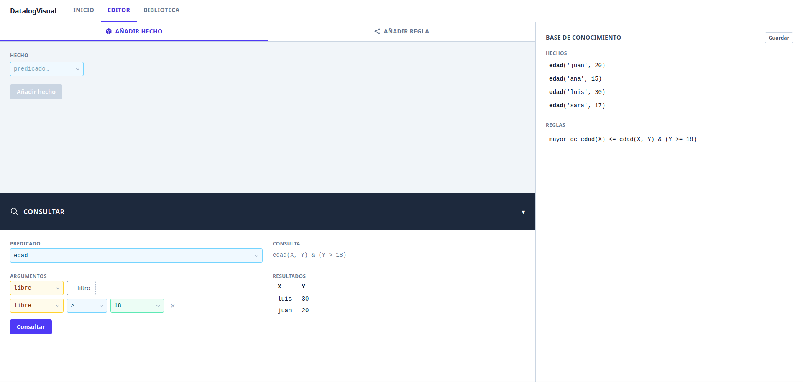

# TFG: IA Simbólica

Se propone el desarrollo de una aplicación web intuitiva que permita a usuarios sin experiencia
previa familiarizarse con la inteligencia artificial simbólica. La herramienta permite definir he-
chos, reglas y consultas sobre una base de conocimiento, ocultando la complejidad sintáctica del
motor lógico subyacente y mostrando en todo momento el estado de dicha base de conocimiento.\

El objetivo final es reducir la barrera de entrada, facilitando la comprensión de los conceptos de
la inteligencia artificial simbólica mediante una experiencia interactiva y permitiendo centrarse
en el aprendizaje.

## Cómo ejecutar

~~~bash
./run.sh    # docker compose up --build
~~~

Y acceder a [localhost:4200](http://localhost:4200).

Ejecutar sin Docker

Requiere Python 3 y Node 22.

- Backend:
~~~bash
cd ./back
source venv/bin/activate
python app.py
~~~

- Frontend:
~~~bash
cd ./front
ng serve
~~~

